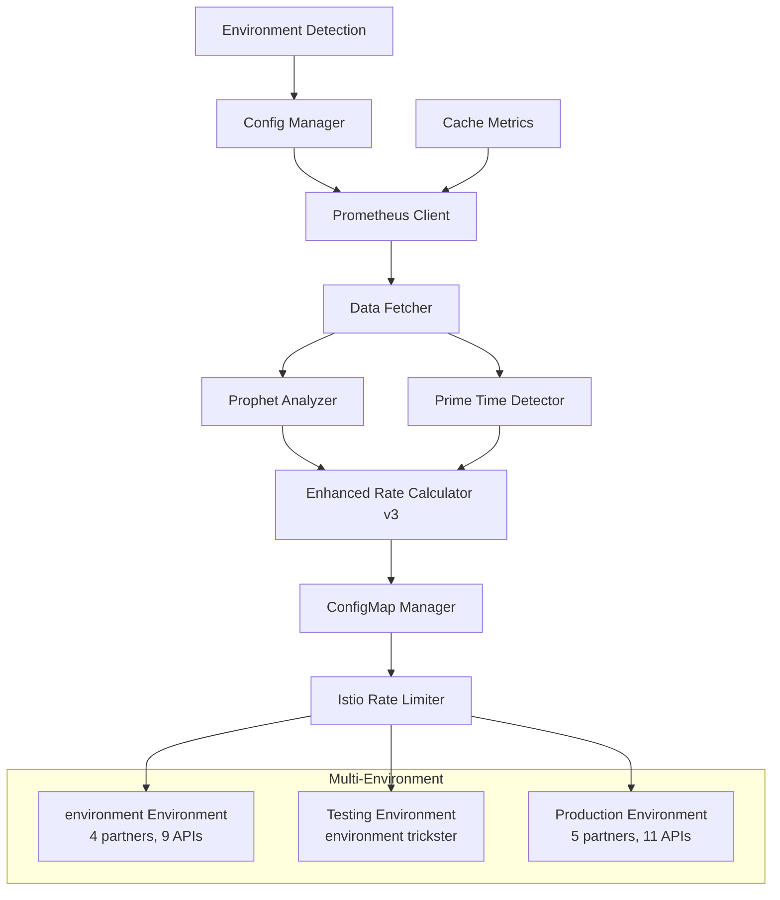

# TrendMaster-AI Adaptive Istio Rate Limiting System v3.0

[](https://github.com/your-org/TrendMaster-AI/actions)
[](https://opensource.org/licenses/MIT)
[](https://www.python.org/downloads/)
[](https://hub.docker.com)

## 🚀 Overview

An intelligent, ML-powered adaptive rate limiting system for Istio service mesh that automatically adjusts rate limits based on real-time traffic analysis, cache performance, and predictive modeling using Facebook Prophet. **Version 3.0** introduces environment-aware configuration, enhanced cache integration, and the new 2.5x peak formula.

### ✨ Key Features

- **🤖 ML-Powered Predictions**: Facebook Prophet for traffic forecasting and anomaly detection
- **🌍 Environment-Aware Configuration**: Automatic environment detection with different partner/API configurations
- **📊 Cache-Aware Rate Limiting**: Real cache hit ratio integration for accurate traffic calculations
- **🎯 Partner-Specific Optimization**: Individual rate limits per partner/API endpoint combination
- **🔄 Multi-Environment Support**: environment, Testing, and Production with different trickster endpoints
- **📈 v3 Formula**: Enhanced 2.5x average peak formula with cache considerations
- **🛡️ Production-Ready**: Comprehensive monitoring, alerting, and rollback capabilities
- **🐳 Docker Support**: Containerized deployment with production optimizations

## 📋 Table of Contents

- [Architecture](#architecture)
- [Quick Start](#quick-start)
- [Environment Configuration](#environment-configuration)
- [Installation](#installation)
- [Usage](#usage)
- [v3 Formula](#v3-formula)
- [Deployment](#deployment)
- [API Reference](#api-reference)
- [Monitoring](#monitoring)
- [Contributing](#contributing)
- [Troubleshooting](#troubleshooting)

## 🏗️ Architecture



### Core Components

| Component | Description | Location |
|-----------|-------------|----------|
| **Config Manager** | Environment-aware configuration with auto-detection | [`scripts/utils/config_manager.py`](scripts/utils/config_manager.py) |
| **Data Fetcher** | Collects metrics from Prometheus and cache systems | [`scripts/core/data_fetcher.py`](scripts/core/data_fetcher.py) |
| **Prophet Analyzer** | ML-based traffic forecasting and anomaly detection | [`scripts/core/prophet_analyzer.py`](scripts/core/prophet_analyzer.py) |
| **Rate Calculator v3** | Enhanced 2.5x peak formula with cache awareness | [`scripts/core/enhanced_rate_calculator.py`](scripts/core/enhanced_rate_calculator.py) |
| **Cache Metrics** | Real-time cache performance analysis | [`scripts/utils/cache_metrics.py`](scripts/utils/cache_metrics.py) |
| **Prime Time Detector** | Dynamic traffic pattern analysis | [`scripts/core/prime_time_detector.py`](scripts/core/prime_time_detector.py) |
| **ConfigMap Manager** | Kubernetes ConfigMap generation and management | [`scripts/k8s_integration/configmap_manager.py`](scripts/k8s_integration/configmap_manager.py) |

## 🚀 Quick Start

### Prerequisites

- Python 3.11+
- Kubernetes cluster with Istio
- Prometheus with service metrics
- kubectl configured
- Docker (for containerized deployments)

### 1-Minute Setup

```bash
# Clone the repository
git clone https://github.com/your-org/TrendMaster-AI.git
cd TrendMaster-AI/adaptive_istio_rate_limit

# Install dependencies
pip install -r requirements.txt

# Set environment and run
ENVIRONMENT=environment python scripts/main.py --show-env

# Run analysis for specific partners
ENVIRONMENT=environment python scripts/main.py --partners 111,222 --apis /api_v3/service/multirequest

# Deploy with Docker
make docker-build
make docker-run
```

## 🌍 Environment Configuration

### Environment-Aware System

The system automatically detects environments and applies appropriate configurations:

| Environment | Partners | APIs | Trickster | Purpose |
|-------------|----------|------|-----------|---------|
| **environment** | 4 (111, 222, 333, 444) | 9 | environment.ott.example.com | Local/Testing |
| **testing** | 4 (111, 222, 333, 444) | 9 | environment.ott.example.com | Integration Tests |
| **production** | 5 (101, 201, 301, 401, 501) | 11 | production.ott.example.com | Live Production |

### Environment Detection

The system automatically detects environment from these variables (in order):
1. `ENVIRONMENT`
2. `ENV` 
3. `example_ENV`
4. `DEPLOYMENT_ENV`

```bash
# Examples
ENVIRONMENT=environment python scripts/main.py --show-env
ENVIRONMENT=production python scripts/main.py --validate-only
ENV=testing python scripts/main.py --partners 111
```

### Configuration Structure

```yaml
# config/config.yaml (sanitized - no sensitive data)
PARTNER_CONFIGS:
  environment:
    partners: []  # Loaded from .local.config.yaml or ConfigMap
    apis: []      # Loaded from .local.config.yaml or ConfigMap

DEPLOYMENT_OVERRIDES:
  local:
    prometheus_url: "${PROMETHEUS_URL}"  # Environment variable
    dry_run: true
  production:
    prometheus_url: "${PROMETHEUS_URL}"  # Environment variable
    dry_run: false
```

### Secure Configuration Model

The system uses a **security-first configuration approach** with sensitive data separation:

#### Configuration Files
- **`config/config.yaml`**: Sanitized main configuration (tracked in git)
- **`.local.config.yaml`**: Hidden local configuration with sensitive data (NOT tracked in git)
- **Environment Variables**: Override URLs and tokens
- **Kubernetes ConfigMaps**: Production environments load from existing Istio ConfigMaps

#### Security Features
- ✅ **No Sensitive Data in Git**: Partner IDs, API paths, and URLs excluded from tracked files
- ✅ **Hidden Local Config**: `.local.config.yaml` contains all sensitive configuration for local development
- ✅ **Environment-Based Loading**: Production/testing loads from ConfigMaps, local uses hidden file
- ✅ **Git Exclusion**: `.local.config.yaml` automatically excluded via `.gitignore`

#### Local Development Setup
```bash
# 1. Copy the local configuration template
cp .local.config.yaml.template .local.config.yaml

# 2. Edit with your actual partner IDs and API paths
vim .local.config.yaml

# 3. Run with local configuration
ENVIRONMENT=environment python scripts/main.py --show-env
```

#### Example `.local.config.yaml`
```yaml
# .local.config.yaml (NOT tracked in git)
PARTNER_CONFIGS:
  environment:
    partners: [111, 222, 333, 444]
    apis:
      - /api_v3/service/multirequest
      - /api_v3/service/asset/action/list
      - /api_v3/service/baseEntry/action/list
      # ... actual API paths
    prometheus_url: "https://trickster.environment.ott.example.com"
```

## 📦 Installation

### Production Installation

```bash
# 1. Install Python dependencies
pip install -r requirements.txt

# 2. Configure environment
export ENVIRONMENT=production
export PROMETHEUS_TOKEN="your-token"

# 3. Configure Kubernetes access
kubectl config current-context

# 4. Deploy to production
make deploy-production
```

### Docker Installation

```bash
# Build production image
make docker-build

# Run with environment variables
docker run -e ENVIRONMENT=production \
           -e PROMETHEUS_TOKEN=your-token \
           trendmaster-ai:latest

# Or use docker-compose
docker-compose up -d
```

### Development Setup

```bash
# 1. Create virtual environment
python -m venv venv
source venv/bin/activate  # On Windows: venv\Scripts\activate

# 2. Install development dependencies
pip install -r requirements.txt

# 3. Run tests
make test

# 4. Start local development
ENVIRONMENT=environment python scripts/main.py --show-env
```

## 🎯 Usage

### Command Line Interface

```bash
# Show environment information
ENVIRONMENT=environment python scripts/main.py --show-env

# Run analysis for specific partners
python scripts/main.py --partners 111,222 --apis /api_v3/service/multirequest

# Validate configuration only
python scripts/main.py --validate-only

# Run with verbose logging
python scripts/main.py --verbose

# Output in different formats
python scripts/main.py --output-format json
python scripts/main.py --output-format yaml
```

### Available Options

| Option | Description | Example |
|--------|-------------|---------|
| `--show-env` | Display environment configuration | `--show-env` |
| `--partners` | Comma-separated partner IDs | `--partners 111,222` |
| `--apis` | Comma-separated API paths | `--apis /api_v3/service/multirequest` |
| `--validate-only` | Only validate configuration | `--validate-only` |
| `--verbose` | Enable verbose logging | `--verbose` |
| `--output-format` | Output format (json/yaml) | `--output-format json` |
| `--config` | Custom configuration file | `--config /path/to/config.yaml` |

### Environment Examples

```bash
# environment environment (local/testing)
ENVIRONMENT=environment python scripts/main.py --partners 111 --verbose

# Production environment
ENVIRONMENT=production python scripts/main.py --validate-only

# Testing with specific APIs
ENVIRONMENT=testing python scripts/main.py \
  --partners 111,222 \
  --apis "/api_v3/service/multirequest,/api_v3/service/asset/action/list"
```

## 📈 v3 Formula

### Enhanced Rate Limiting Formula

Version 3.0 introduces an advanced formula that considers cache performance and environment-specific factors:

```python
# Core v3 Formula: 2.5x Average Peak (excluding anomalies)
effective_peak = calculate_average_peak_excluding_anomalies(traffic_data)
base_rate = effective_peak * 2.5

# Cache-Aware Adjustment
cache_hit_ratio = get_real_cache_metrics()
cache_adjustment = 1.0 + (cache_hit_ratio * 0.2)  # Up to 20% adjustment
adjusted_rate = base_rate * cache_adjustment

# Environment-Specific Safety Margins
safety_margin = get_environment_safety_margin()  # 1.5x for production
final_rate = adjusted_rate * safety_margin

# Apply bounds and rounding
final_rate = apply_bounds_and_rounding(final_rate)
```

### Formula Components

| Component | Description | Impact |
|-----------|-------------|--------|
| **2.5x Multiplier** | Base multiplier for average peaks | Core rate calculation |
| **Anomaly Filtering** | Excludes traffic spikes from calculation | More stable rates |
| **Cache Adjustment** | Real cache hit ratio integration | Accurate traffic estimation |
| **Environment Safety** | Environment-specific safety margins | Production protection |
| **Traffic Patterns** | Variable/stable pattern detection | Adaptive adjustments |

### Example Calculation

```
Partner 111, API /api_v3/service/multirequest:
- Average Peak: 68.0 req/min (anomalies excluded)
- Base Rate: 68.0 * 2.5 = 170 req/min
- Cache Adjustment: 170 * 1.2 = 204 req/min
- Safety Margin: 204 * 1.5 = 306 req/min
- Final Rate: 500 req/min (rounded up)
- Confidence: 76.25% (medium)
```

## 🚀 Deployment

### Available Commands

```bash
# Local Development
make deploy-local          # Deploy to local environment
make test-local           # Run local tests

# Testing Environment  
make deploy-testing       # Deploy to testing environment
make test-integration     # Run integration tests

# Production Environment
make deploy-production    # Deploy to production
make rollback-production  # Rollback production deployment
make health-check        # Check system health

# Docker Operations
make docker-build        # Build Docker image
make docker-run          # Run Docker container
make docker-push         # Push to registry

# Utilities
make clean               # Clean generated files
make logs               # View deployment logs
make monitor            # Start monitoring dashboard
```

### Deployment Process

#### 1. Local Development
```bash
ENVIRONMENT=environment make deploy-local
```
- Uses environment environment configuration
- Mock data for development
- Generates ConfigMaps in `output/` directory
- Safe dry-run mode enabled

#### 2. Testing Deployment
```bash
ENVIRONMENT=testing make deploy-testing
```
- Uses environment trickster for testing
- Same partners as local (111, 222, 333, 444)
- Integration tests included
- Canary deployment strategy

#### 3. Production Deployment
```bash
ENVIRONMENT=production make deploy-production
```
- Production partners (101, 201, 301, 401, 501)
- Production trickster endpoint
- Blue-green deployment strategy
- Comprehensive health checks
- Automatic rollback on failure

### Docker Deployment

```bash
# Build and run with Docker
make docker-build
docker run -e ENVIRONMENT=production \
           -e PROMETHEUS_TOKEN=your-token \
           -v /path/to/kubeconfig:/root/.kube/config \
           trendmaster-ai:latest

# Or use docker-compose
cat > docker-compose.yml << EOF
version: '3.8'
services:
  trendmaster-ai:
    build: .
    environment:
      - ENVIRONMENT=production
      - PROMETHEUS_TOKEN=your-token
    volumes:
      - ~/.kube/config:/root/.kube/config:ro
      - ./output:/app/output
EOF

docker-compose up -d
```

## 📊 Monitoring & Observability

### System Health

```bash
# Check environment configuration
ENVIRONMENT=environment python scripts/main.py --show-env

# Validate configuration
python scripts/main.py --validate-only

# View generated reports
ls -la output/analysis_report_*.md

# Check logs
tail -f logs/adaptive_rate_limiter_*.log
```

### Key Metrics

| Metric | Description | Environment Impact |
|--------|-------------|-------------------|
| `partners_processed` | Number of partners analyzed | Varies by environment |
| `apis_processed` | Number of APIs analyzed | 9 (environment) vs 11 (production) |
| `confidence_score` | ML prediction confidence | Affected by data quality |
| `cache_hit_ratio` | Real cache performance | Environment-specific |
| `rate_limit_adjustments` | Formula adjustments applied | Environment safety margins |

### Generated Reports

The system generates comprehensive reports:

```markdown
# Example Report Output
Environment: environment
Partners: 4 configured (111, 222, 333, 444)
APIs: 9 configured
Trickster: environment.ott.example.com
Formula: v3 (2.5x average peaks)

Results:
- Partner 111: 500 req/min (confidence: 76.25%)
- Applied v3 formula with cache adjustment
- Safety margin applied for variable traffic
```

## 🧪 Testing

### Test Suite

```bash
# Run all tests
make test

# Run specific test categories
make test-unit              # Unit tests
make test-integration       # Integration tests
make test-environment       # Environment-specific tests
make test-performance       # Performance tests

# Test specific environments
ENVIRONMENT=environment python -m pytest tests/test_environment_integration.py
ENVIRONMENT=production python -m pytest tests/test_environment_integration.py
```

### Environment Integration Tests

```python
# tests/test_environment_integration.py
def test_environment_environment():
    """Test environment environment configuration"""
    config = ConfigManager(environment='environment')
    assert len(config.get_partners()) == 4
    assert '111' in config.get_partners()
    assert config.get_prometheus_url().endswith('environment.ott.example.com')

def test_production_environment():
    """Test production environment configuration"""
    config = ConfigManager(environment='production')
    assert len(config.get_partners()) == 5
    assert '101' in config.get_partners()
    assert config.get_prometheus_url().endswith('production.ott.example.com')
```

## 🔧 API Reference

### Core APIs

#### Environment-Aware Configuration
```python
from scripts.utils.config_manager import ConfigManager

# Auto-detect environment
config = ConfigManager()
env_info = config.get_environment_info()

# Specific environment
config = ConfigManager(environment='production')
partners = config.get_partners()  # [101, 201, 301, 401, 501]
```

#### Rate Calculation with v3 Formula
```python
from scripts.core.enhanced_rate_calculator import EnhancedRateCalculator

calculator = EnhancedRateCalculator(config, prometheus_client)
result = calculator.calculate_rate_limit(
    partner_id="111",
    path="/api_v3/service/multirequest",
    traffic_data=metrics_data,
    cache_metrics=cache_data
)

# Result includes v3 formula details
print(f"Rate: {result['recommended_rate_limit']} req/min")
print(f"Confidence: {result['confidence']['overall_confidence']}")
print(f"Formula: {result['calculation_method']}")
```

#### Environment Detection
```python
from scripts.utils.config_manager import ConfigManager

config = ConfigManager()
print(f"Environment: {config.current_environment}")
print(f"Partners: {config.get_partners()}")
print(f"Trickster: {config.get_prometheus_url()}")
```

### CLI Integration

```bash
# Get help
python scripts/main.py --help

# Environment information
python scripts/main.py --show-env

# Specific analysis
python scripts/main.py --partners 111 --apis /api_v3/service/multirequest --verbose
```

## 🛠️ Troubleshooting

### Common Issues

#### 1. Environment Detection Issues
```bash
# Check environment variables
echo $ENVIRONMENT $ENV $example_ENV

# Force specific environment
ENVIRONMENT=environment python scripts/main.py --show-env

# Validate configuration
python scripts/main.py --validate-only
```

#### 2. Prometheus Connection Issues
```bash
# Test connectivity for environment
curl -H "Authorization: Bearer $PROMETHEUS_TOKEN" \
     "https://trickster.environment.ott.example.com/api/v1/query?query=up"

# Test connectivity for production
curl -H "Authorization: Bearer $PROMETHEUS_TOKEN" \
     "https://trickster.production.ott.example.com/api/v1/query?query=up"
```

#### 3. Partner Configuration Issues
```bash
# Check partner configuration
ENVIRONMENT=environment python -c "
from scripts.utils.config_manager import ConfigManager
config = ConfigManager()
print('Partners:', config.get_partners())
print('APIs:', len(config.get_apis()))
"

# Verify partner exists in environment
python scripts/main.py --partners 111 --validate-only
```

#### 4. ConfigMap Generation Issues
```bash
# Check generated ConfigMaps
ls -la output/

# Validate ConfigMap structure
kubectl apply --dry-run=client -f output/latest_configmap.yaml

# Check Kubernetes connectivity
kubectl get nodes
```

### Debug Mode

```bash
# Enable debug logging
export LOG_LEVEL=DEBUG
ENVIRONMENT=environment python scripts/main.py --verbose

# View detailed logs
tail -f logs/adaptive_rate_limiter_environment_*.log

# Check specific component logs
grep "ConfigManager" logs/adaptive_rate_limiter_*.log
grep "v3 formula" logs/adaptive_rate_limiter_*.log
```

### Environment-Specific Debugging

```bash
# Debug environment environment
ENVIRONMENT=environment LOG_LEVEL=DEBUG python scripts/main.py \
  --partners 111 --verbose

# Debug production environment  
ENVIRONMENT=production LOG_LEVEL=DEBUG python scripts/main.py \
  --validate-only --verbose

# Compare environments
diff <(ENVIRONMENT=environment python scripts/main.py --show-env) \
     <(ENVIRONMENT=production python scripts/main.py --show-env)
```

## 🤝 Contributing

### Development Workflow

1. **Fork** the repository
2. **Create** a feature branch: `git checkout -b feature/amazing-feature`
3. **Test** across environments: `make test-all-environments`
4. **Commit** changes: `git commit -m 'Add amazing feature'`
5. **Push** to branch: `git push origin feature/amazing-feature`
6. **Open** a Pull Request

### Code Standards

- **Python**: Follow PEP 8 style guide
- **Testing**: Test all environments (environment, testing, production)
- **Documentation**: Update docs for environment-specific changes
- **Linting**: Use `black`, `flake8`, and `mypy`
- **Environment Testing**: Validate changes across all environments

### Environment Testing Requirements

```bash
# Test all environments before submitting PR
ENVIRONMENT=environment make test
ENVIRONMENT=testing make test  
ENVIRONMENT=production make test-validation

# Ensure environment-specific features work
python tests/test_environment_integration.py
```

## 📄 License

This project is licensed under the MIT License - see the [LICENSE](LICENSE) file for details.

## 🙏 Acknowledgments

- **Facebook Prophet**: Time series forecasting
- **Istio Community**: Service mesh platform  
- **Prometheus**: Monitoring and alerting
- **Kubernetes**: Container orchestration
- **example**: Multi-environment infrastructure support

## 📞 Support

- **Documentation**: [docs/](docs/)
- **Issues**: [GitHub Issues](https://github.com/your-org/TrendMaster-AI/issues)
- **Discussions**: [GitHub Discussions](https://github.com/your-org/TrendMaster-AI/discussions)
- **Email**: support@trendmaster-ai.com

## 🆕 What's New in v3.0

### Environment-Aware Configuration
- ✅ Automatic environment detection from environment variables
- ✅ Different partner/API configurations per environment
- ✅ Environment-specific trickster endpoints
- ✅ environment trickster for local/testing, production trickster for production

### Enhanced v3 Formula
- ✅ 2.5x average peak multiplier (excluding anomalies)
- ✅ Real cache hit ratio integration
- ✅ Environment-specific safety margins
- ✅ Improved confidence scoring

### Production Improvements
- ✅ Docker containerization with multi-stage builds
- ✅ Comprehensive logging and monitoring
- ✅ Enhanced error handling and validation
- ✅ Production-ready deployment scripts

### Developer Experience
- ✅ Improved CLI with comprehensive options
- ✅ Environment validation and debugging tools
- ✅ Comprehensive test suite for all environments
- ✅ Detailed analysis reports and documentation

---

**Made with ❤️ by the TrendMaster-AI Team**

*TrendMaster-AI v3.0 - Intelligent, Environment-Aware, Production-Ready Rate Limiting*