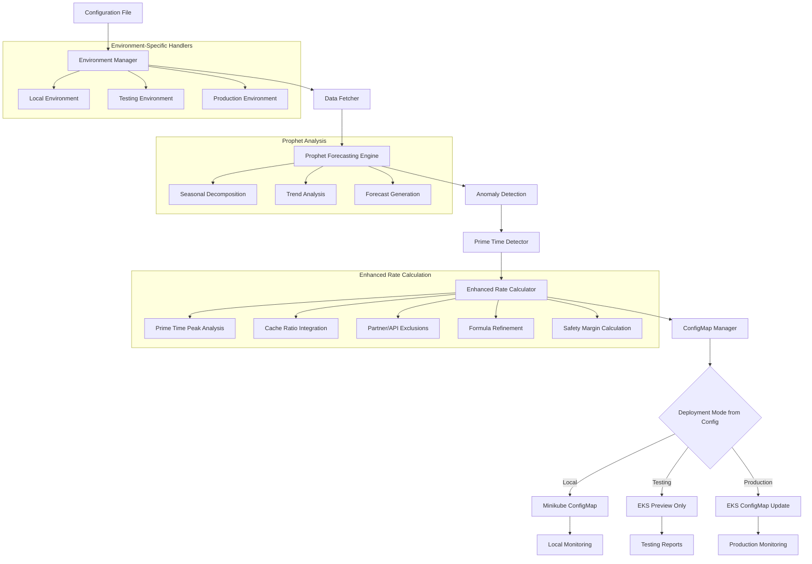

# Adaptive Istio Rate Limit System - Architecture Plan

## Project Overview

This document outlines the architecture for enhancing the existing TrendMaster-AI adaptive Istio rate limiting system. The system uses Prophet-based time series forecasting and anomaly detection specifically to improve rate limit calculations by filtering out anomalous traffic spikes and identifying optimal rate limits based on genuine traffic patterns.

The system supports three deployment modes configured via configuration file:
- **Local Mode:** Development and testing on MacBook with Minikube
- **Testing Mode:** EKS integration with preview-only functionality
- **Production Mode:** Full EKS deployment with ConfigMap updates

## Current State Analysis

Based on the existing repository structure and identified next steps:

**Existing Components:**
- Basic rate limit calculation in `scripts/istio_ratelimit_values.py`
- Simple statistical analysis using min/max/mean calculations
- ConfigMap generation for Istio rate limiting
- Kubernetes deployment infrastructure
- Prometheus metrics integration
- Cache ratio integration (partially implemented)

**Current Issues to Address (from project notes):**
- ✅ **Done:** Script parsing validation - partners and APIs are correctly identified
- **Check the formula** - Rate limit calculation needs refinement
- **Add cache ratio to the formula** - Cache ratio integration needs enhancement
- **Get the configmap from the env** - Dynamic ConfigMap fetching from Kubernetes
- **Fix dates of max** - Maximum value timestamp handling needs correction
- **Think of exclusions api/partner** - Partner/API exclusion logic enhancement
- **Arrange the code** - Code organization and modularization
- **Update the CM** - ConfigMap update mechanism
- **Deploy it as an operator** - Kubernetes operator deployment

**Missing Components:**
- Prophet integration for advanced forecasting
- Anomaly detection for filtering traffic spikes
- Dynamic prime time detection
- Enhanced rate limit calculation algorithms
- Multi-environment deployment support (local/testing/prod)

## Enhanced System Architecture



## Multi-Environment Configuration Structure

### Enhanced Configuration File Structure

The deployment mode and environment-specific settings are configured via the main configuration file:

```yaml
# config/config.yaml - Enhanced configuration with deployment modes

# Deployment Configuration
DEPLOYMENT:
  MODE: "local"  # Options: "local", "testing", "production"
  ENVIRONMENT: "development"  # Environment identifier

# Environment-Specific Configurations
ENVIRONMENTS:
  local:
    PROMETHEUS_URL: "http://localhost:9090"
    KUBERNETES_CONFIG: "~/.kube/config"
    KUBERNETES_CONTEXT: "minikube"
    CONFIGMAP_NAMESPACE: "default"
    DRY_RUN: true
    PREVIEW_ONLY: true
    USE_MOCK_DATA: true
    VERBOSE_LOGGING: true
    
  testing:
    PROMETHEUS_URL: "https://prometheus.eks-testing.company.com"
    KUBERNETES_CONFIG: "~/.kube/config"
    KUBERNETES_CONTEXT: "eks-testing"
    CONFIGMAP_NAMESPACE: "istio-system"
    DRY_RUN: true
    PREVIEW_ONLY: true
    USE_MOCK_DATA: false
    GENERATE_REPORTS: true
    
  production:
    PROMETHEUS_URL: "https://prometheus.eks-prod.company.com"
    KUBERNETES_CONFIG: "~/.kube/config"
    KUBERNETES_CONTEXT: "eks-production"
    CONFIGMAP_NAMESPACE: "istio-system"
    DRY_RUN: false
    PREVIEW_ONLY: false
    ENABLE_UPDATES: true
    MONITORING_ENABLED: true

# Common Configuration (applies to all environments)
COMMON:
  DAYS_TO_INSPECT: 7
  LOG_LEVEL: "DEBUG"
  SHOW_ONLY_CONFIGURED: true
  
  # Enhanced Rate Calculation
  RATE_CALCULATION:
    cache_ratio: 1.2
    formula_version: "v2"
    safety_margin: 1.3
    min_rate_limit: 100
    max_rate_limit: 100000
    rounding_method: "nearest_hundred"

  # Enhanced Exclusions
  EXCLUSIONS:
    partners: ["test_partner", "dev_partner"]
    paths: ["/health", "/status", "/metrics"]
    conditional_exclusions:
      low_traffic: ["partner_123"]
      partner_paths:
        "CUSTOMER_ID_1": ["/internal/debug"]
        "CUSTOMER_ID_3": ["/admin/test"]

  # Prophet Configuration
  PROPHET_CONFIG:
    enabled: true
    seasonality_mode: 'multiplicative'
    weekly_seasonality: true
    daily_seasonality: true
    uncertainty_samples: 1000

  # Prime Time Detection
  PRIME_TIME_CONFIG:
    detection_method: 'dynamic'
    percentile_threshold: 75
    min_duration: 60

  # Kubernetes Operator
  OPERATOR_CONFIG:
    enabled: false  # Disabled by default, enabled in production
    interval: 300
    configmap_name: "ratelimit-config"

  # Monitoring
  MONITORING:
    enabled: true
    alert_threshold: 0.2
    metrics_retention: 30
```

## Detailed Implementation Plan

### Phase 1: Configuration-Based Environment Management

#### 1.1 Enhanced Configuration Manager
**File:** `scripts/core/config_manager.py`

```python
import yaml
import os
from typing import Dict, Any

class ConfigManager:
    def __init__(self, config_path: str = 'config/config.yaml'):
        self.config_path = config_path
        self.config = self.load_configuration()
        self.deployment_mode = self.config['DEPLOYMENT']['MODE']
        self.environment_config = self.merge_environment_config()
    
    def load_configuration(self) -> Dict[str, Any]:
        """Load configuration from YAML file"""
        if not os.path.exists(self.config_path):
            raise FileNotFoundError(f"Configuration file not found: {self.config_path}")
        
        with open(self.config_path, 'r') as file:
            config = yaml.safe_load(file)
        
        # Validate required sections
        required_sections = ['DEPLOYMENT', 'ENVIRONMENTS', 'COMMON']
        for section in required_sections:
            if section not in config:
                raise KeyError(f"Required configuration section missing: {section}")
        
        return config
    
    def merge_environment_config(self) -> Dict[str, Any]:
        """Merge common config with environment-specific config"""
        mode = self.deployment_mode
        
        if mode not in self.config['ENVIRONMENTS']:
            raise ValueError(f"Unknown deployment mode: {mode}")
        
        # Start with common configuration
        merged_config = self.config['COMMON'].copy()
        
        # Override with environment-specific settings
        env_config = self.config['ENVIRONMENTS'][mode]
        merged_config.update(env_config)
        
        # Add deployment metadata
        merged_config['DEPLOYMENT_MODE'] = mode
        merged_config['ENVIRONMENT'] = self.config['DEPLOYMENT'].get('ENVIRONMENT', mode)
        
        return merged_config
    
    def get_config(self) -> Dict[str, Any]:
        """Get the merged configuration"""
        return self.environment_config
    
    def is_local_mode(self) -> bool:
        """Check if running in local mode"""
        return self.deployment_mode == 'local'
    
    def is_testing_mode(self) -> bool:
        """Check if running in testing mode"""
        return self.deployment_mode == 'testing'
    
    def is_production_mode(self) -> bool:
        """Check if running in production mode"""
        return self.deployment_mode == 'production'
    
    def should_preview_only(self) -> bool:
        """Check if system should run in preview-only mode"""
        return self.environment_config.get('PREVIEW_ONLY', True)
    
    def should_update_configmap(self) -> bool:
        """Check if system should update ConfigMaps"""
        return (
            not self.environment_config.get('DRY_RUN', True) and
            self.environment_config.get('ENABLE_UPDATES', False)
        )
```

#### 1.2 Environment-Aware Main Script
**File:** `scripts/main.py`

```python
#!/usr/bin/env python3
import sys
import logging
from core.config_manager import ConfigManager
from core.adaptive_rate_limiter import AdaptiveRateLimiter

def setup_logging(config):
    """Setup logging based on configuration"""
    log_level = config.get('LOG_LEVEL', 'INFO')
    verbose = config.get('VERBOSE_LOGGING', False)
    
    if verbose:
        log_format = '%(asctime)s - %(name)s - %(levelname)s - %(message)s'
    else:
        log_format = '%(asctime)s - %(levelname)s - %(message)s'
    
    logging.basicConfig(
        level=getattr(logging, log_level.upper()),
        format=log_format
    )

def main():
    try:
        # Load configuration
        config_manager = ConfigManager()
        config = config_manager.get_config()
        
        # Setup logging
        setup_logging(config)
        logger = logging.getLogger(__name__)
        
        # Log deployment mode
        mode = config_manager.deployment_mode
        logger.info(f"Starting Adaptive Rate Limiter in {mode.upper()} mode")
        
        # Log key configuration settings
        logger.info(f"Prometheus URL: {config.get('PROMETHEUS_URL')}")
        logger.info(f"Kubernetes Context: {config.get('KUBERNETES_CONTEXT')}")
        logger.info(f"Preview Only: {config_manager.should_preview_only()}")
        logger.info(f"ConfigMap Updates: {config_manager.should_update_configmap()}")
        
        # Initialize and run the adaptive rate limiter
        rate_limiter = AdaptiveRateLimiter(config)
        rate_limiter.run()
        
        logger.info("Adaptive Rate Limiter completed successfully")
        
    except Exception as e:
        logging.error(f"Error running Adaptive Rate Limiter: {e}")
        sys.exit(1)

if __name__ == "__main__":
    main()
```

### Phase 2: Environment-Specific Implementations

#### 2.1 Local Development Environment Handler
**File:** `scripts/environments/local_environment.py`

```python
class LocalEnvironmentHandler:
    def __init__(self, config):
        self.config = config
        self.use_mock_data = config.get('USE_MOCK_DATA', True)
    
    def setup_kubernetes_client(self):
        """Setup Kubernetes client for Minikube"""
        from kubernetes import client, config as k8s_config
        
        try:
            # Load kubeconfig for minikube
            k8s_config.load_kube_config(
                config_file=self.config.get('KUBERNETES_CONFIG'),
                context=self.config.get('KUBERNETES_CONTEXT')
            )
            return client.CoreV1Api()
        except Exception as e:
            logging.warning(f"Could not connect to Minikube: {e}")
            return None
    
    def get_prometheus_data(self, query, days):
        """Get Prometheus data - use mock data for local development"""
        if self.use_mock_data:
            return self.generate_mock_prometheus_data()
        else:
            # Use actual Prometheus if available locally
            return self.fetch_real_prometheus_data(query, days)
    
    def generate_mock_prometheus_data(self):
        """Generate mock Prometheus data for local testing"""
        import pandas as pd
        from datetime import datetime, timedelta
        import numpy as np
        
        # Generate realistic mock data
        partners = ['CUSTOMER_ID_1', 'CUSTOMER_ID_3', 'CUSTOMER_ID_4']
        paths = [
            '/api_v3/service/configurations/action/servebydevice',
            '/api_v3/service/ENDPOINT_8playbackcontext',
            '/api_v3/service/userassetrule/action/list'
        ]
        
        mock_results = []
        for partner in partners:
            for path in paths:
                # Generate time series data
                timestamps = pd.date_range(
                    start=datetime.now() - timedelta(days=7),
                    end=datetime.now(),
                    freq='1min'
                )
                
                # Generate realistic traffic patterns
                base_traffic = np.random.poisson(50, len(timestamps))
                # Add daily seasonality
                daily_pattern = 20 * np.sin(2 * np.pi * timestamps.hour / 24)
                # Add some noise and spikes
                noise = np.random.normal(0, 5, len(timestamps))
                spikes = np.random.choice([0, 100], len(timestamps), p=[0.99, 0.01])
                
                values = base_traffic + daily_pattern + noise + spikes
                values = np.maximum(values, 0)  # Ensure non-negative
                
                mock_results.append({
                    'metric': {'partner': partner, 'path': path},
                    'values': list(zip(timestamps.astype(int) // 10**9, values))
                })
        
        return mock_results
```

#### 2.2 Testing Environment Handler
**File:** `scripts/environments/testing_environment.py`

```python
class TestingEnvironmentHandler:
    def __init__(self, config):
        self.config = config
        self.generate_reports = config.get('GENERATE_REPORTS', True)
    
    def setup_kubernetes_client(self):
        """Setup Kubernetes client for EKS testing"""
        from kubernetes import client, config as k8s_config
        
        k8s_config.load_kube_config(
            config_file=self.config.get('KUBERNETES_CONFIG'),
            context=self.config.get('KUBERNETES_CONTEXT')
        )
        return client.CoreV1Api()
    
    def preview_configmap_changes(self, current_cm, proposed_cm):
        """Generate detailed preview of ConfigMap changes"""
        import difflib
        
        current_yaml = yaml.dump(current_cm, default_flow_style=False)
        proposed_yaml = yaml.dump(proposed_cm, default_flow_style=False)
        
        diff = list(difflib.unified_diff(
            current_yaml.splitlines(keepends=True),
            proposed_yaml.splitlines(keepends=True),
            fromfile='current_configmap.yaml',
            tofile='proposed_configmap.yaml'
        ))
        
        if self.generate_reports:
            self.generate_testing_report(diff, current_cm, proposed_cm)
        
        return diff
    
    def generate_testing_report(self, diff, current_cm, proposed_cm):
        """Generate comprehensive testing report"""
        report_path = f"reports/testing_report_{datetime.now().strftime('%Y%m%d_%H%M%S')}.md"
        
        with open(report_path, 'w') as f:
            f.write("# Adaptive Rate Limit Testing Report\n\n")
            f.write(f"Generated: {datetime.now().isoformat()}\n")
            f.write(f"Environment: {self.config.get('ENVIRONMENT')}\n\n")
            
            f.write("## ConfigMap Changes\n\n")
            f.write("```diff\n")
            f.write(''.join(diff))
            f.write("\n```\n\n")
            
            f.write("## Impact Analysis\n\n")
            self.write_impact_analysis(f, current_cm, proposed_cm)
        
        logging.info(f"Testing report generated: {report_path}")
```

#### 2.3 Production Environment Handler
**File:** `scripts/environments/production_environment.py`

```python
class ProductionEnvironmentHandler:
    def __init__(self, config):
        self.config = config
        self.monitoring_enabled = config.get('MONITORING_ENABLED', True)
    
    def setup_kubernetes_client(self):
        """Setup Kubernetes client for EKS production"""
        from kubernetes import client, config as k8s_config
        
        k8s_config.load_kube_config(
            config_file=self.config.get('KUBERNETES_CONFIG'),
            context=self.config.get('KUBERNETES_CONTEXT')
        )
        return client.CoreV1Api()
    
    def update_configmap_safely(self, configmap_name, new_data):
        """Safely update ConfigMap in production with rollback capability"""
        k8s_client = self.setup_kubernetes_client()
        namespace = self.config.get('CONFIGMAP_NAMESPACE')
        
        try:
            # Backup current ConfigMap
            current_cm = k8s_client.read_namespaced_config_map(
                name=configmap_name,
                namespace=namespace
            )
            self.backup_configmap(current_cm)
            
            # Validate new ConfigMap
            self.validate_production_configmap(new_data)
            
            # Apply update
            updated_cm = k8s_client.patch_namespaced_config_map(
                name=configmap_name,
                namespace=namespace,
                body=new_data
            )
            
            # Monitor for issues
            if self.monitoring_enabled:
                self.monitor_configmap_deployment(configmap_name)
            
            logging.info(f"Production ConfigMap {configmap_name} updated successfully")
            return updated_cm
            
        except Exception as e:
            logging.error(f"Failed to update production ConfigMap: {e}")
            # Attempt rollback
            self.rollback_configmap(configmap_name, current_cm)
            raise
    
    def backup_configmap(self, configmap):
        """Backup ConfigMap before updates"""
        backup_path = f"backups/configmap_backup_{datetime.now().strftime('%Y%m%d_%H%M%S')}.yaml"
        os.makedirs(os.path.dirname(backup_path), exist_ok=True)
        
        with open(backup_path, 'w') as f:
            yaml.dump(configmap.to_dict(), f, default_flow_style=False)
        
        logging.info(f"ConfigMap backed up to: {backup_path}")
    
    def monitor_configmap_deployment(self, configmap_name):
        """Monitor ConfigMap deployment for issues"""
        # Implementation for monitoring deployment health
        # Check for error rates, response times, etc.
        pass
```

### Phase 3: Enhanced Core Components

#### 3.1 Environment-Aware Adaptive Rate Limiter
**File:** `scripts/core/adaptive_rate_limiter.py`

```python
class AdaptiveRateLimiter:
    def __init__(self, config):
        self.config = config
        self.deployment_mode = config.get('DEPLOYMENT_MODE')
        self.environment_handler = self.setup_environment_handler()
        
    def setup_environment_handler(self):
        """Setup appropriate environment handler based on deployment mode"""
        if self.deployment_mode == 'local':
            from environments.local_environment import LocalEnvironmentHandler
            return LocalEnvironmentHandler(self.config)
        elif self.deployment_mode == 'testing':
            from environments.testing_environment import TestingEnvironmentHandler
            return TestingEnvironmentHandler(self.config)
        elif self.deployment_mode == 'production':
            from environments.production_environment import ProductionEnvironmentHandler
            return ProductionEnvironmentHandler(self.config)
        else:
            raise ValueError(f"Unknown deployment mode: {self.deployment_mode}")
    
    def run(self):
        """Main execution flow"""
        logging.info(f"Running in {self.deployment_mode} mode")
        
        # Fetch metrics based on environment
        metrics_data = self.fetch_metrics()
        
        # Process metrics with Prophet and anomaly detection
        processed_data = self.process_metrics_with_prophet(metrics_data)
        
        # Calculate new rate limits
        new_rate_limits = self.calculate_adaptive_rate_limits(processed_data)
        
        # Handle ConfigMap operations based on environment
        self.handle_configmap_operations(new_rate_limits)
    
    def handle_configmap_operations(self, new_rate_limits):
        """Handle ConfigMap operations based on deployment mode"""
        if self.deployment_mode == 'local':
            self.handle_local_configmap(new_rate_limits)
        elif self.deployment_mode == 'testing':
            self.handle_testing_configmap(new_rate_limits)
        elif self.deployment_mode == 'production':
            self.handle_production_configmap(new_rate_limits)
    
    def handle_local_configmap(self, new_rate_limits):
        """Handle ConfigMap operations for local development"""
        # Generate ConfigMap and save locally
        configmap_data = self.generate_configmap(new_rate_limits)
        
        # Save to local file for inspection
        local_output_path = 'output/local_configmap.yaml'
        os.makedirs(os.path.dirname(local_output_path), exist_ok=True)
        
        with open(local_output_path, 'w') as f:
            yaml.dump(configmap_data, f, default_flow_style=False)
        
        logging.info(f"Local ConfigMap saved to: {local_output_path}")
        
        # If Minikube is available, optionally apply there
        if self.config.get('APPLY_TO_MINIKUBE', False):
            self.apply_to_minikube(configmap_data)
    
    def handle_testing_configmap(self, new_rate_limits):
        """Handle ConfigMap operations for testing environment"""
        # Fetch current ConfigMap from EKS
        current_cm = self.fetch_current_configmap()
        
        # Generate proposed ConfigMap
        proposed_cm = self.generate_configmap(new_rate_limits)
        
        # Generate preview and reports
        diff = self.environment_handler.preview_configmap_changes(current_cm, proposed_cm)
        
        # Display preview
        self.display_configmap_preview(diff, proposed_cm)
    
    def handle_production_configmap(self, new_rate_limits):
        """Handle ConfigMap operations for production environment"""
        if self.config.get('ENABLE_UPDATES', False):
            # Generate new ConfigMap
            new_configmap = self.generate_configmap(new_rate_limits)
            
            # Apply to production with safety measures
            self.environment_handler.update_configmap_safely(
                self.config.get('CONFIGMAP_NAME'),
                new_configmap
            )
        else:
            logging.warning("Production updates disabled in configuration")
```

## Implementation Sequence

### Step 1: Configuration Enhancement
1. **Create Enhanced Config Structure:**
   - Update `config/config.yaml` with deployment modes
   - Add environment-specific sections
   - Include all necessary parameters for each mode

2. **Implement Configuration Manager:**
   - Create `scripts/core/config_manager.py`
   - Add configuration validation
   - Implement environment merging logic

### Step 2: Environment Handlers
1. **Create Environment Handler Framework:**
   - Implement base environment handler
   - Create local, testing, and production handlers
   - Add environment-specific logic for each mode

2. **Local Development Setup:**
   - Add Minikube integration
   - Implement mock data generation
   - Create local testing capabilities

### Step 3: Enhanced Main Application
1. **Refactor Main Script:**
   - Update to use configuration-based mode selection
   - Integrate environment handlers
   - Add comprehensive logging

2. **Testing and Validation:**
   - Test each deployment mode
   - Validate configuration loading
   - Ensure proper environment switching

## Sample Configuration Files

### Local Development Configuration
```yaml
# config/local-config.yaml
DEPLOYMENT:
  MODE: "local"
  ENVIRONMENT: "development"

ENVIRONMENTS:
  local:
    PROMETHEUS_URL: "http://localhost:9090"
    KUBERNETES_CONFIG: "~/.kube/config"
    KUBERNETES_CONTEXT: "minikube"
    CONFIGMAP_NAMESPACE: "default"
    USE_MOCK_DATA: true
    APPLY_TO_MINIKUBE: false
```

### Testing Configuration
```yaml
# config/testing-config.yaml
DEPLOYMENT:
  MODE: "testing"
  ENVIRONMENT: "eks-testing"

ENVIRONMENTS:
  testing:
    PROMETHEUS_URL: "https://prometheus.eks-testing.company.com"
    KUBERNETES_CONTEXT: "eks-testing"
    GENERATE_REPORTS: true
    PREVIEW_ONLY: true
```

### Production Configuration
```yaml
# config/production-config.yaml
DEPLOYMENT:
  MODE: "production"
  ENVIRONMENT: "eks-production"

ENVIRONMENTS:
  production:
    PROMETHEUS_URL: "https://prometheus.eks-prod.company.com"
    KUBERNETES_CONTEXT: "eks-production"
    ENABLE_UPDATES: true
    MONITORING_ENABLED: true
```

## Usage Examples

### Local Development
```bash
# Use local configuration
python3 scripts/main.py --config config/local-config.yaml

# Or modify main config.yaml to set MODE: "local"
python3 scripts/main.py
```

### Testing Environment
```bash
# Use testing configuration
python3 scripts/main.py --config config/testing-config.yaml

# Or modify main config.yaml to set MODE: "testing"
python3 scripts/main.py
```

### Production Deployment
```bash
# Use production configuration
python3 scripts/main.py --config config/production-config.yaml

# Or modify main config.yaml to set MODE: "production"
python3 scripts/main.py
```

## Risk Mitigation & Safety

### Configuration Validation
- Validate all required configuration parameters
- Ensure environment-specific settings are present
- Prevent accidental production updates

### Environment Isolation
- Clear separation between local, testing, and production
- Different Kubernetes contexts for each environment
- Separate Prometheus endpoints and namespaces

### Safety Mechanisms
- Dry-run mode for testing
- Preview-only mode for validation
- Backup and rollback capabilities for production
- Comprehensive logging and monitoring

This architecture provides a robust, configuration-driven approach to managing the adaptive rate limiting system across different environments while maintaining safety and flexibility.