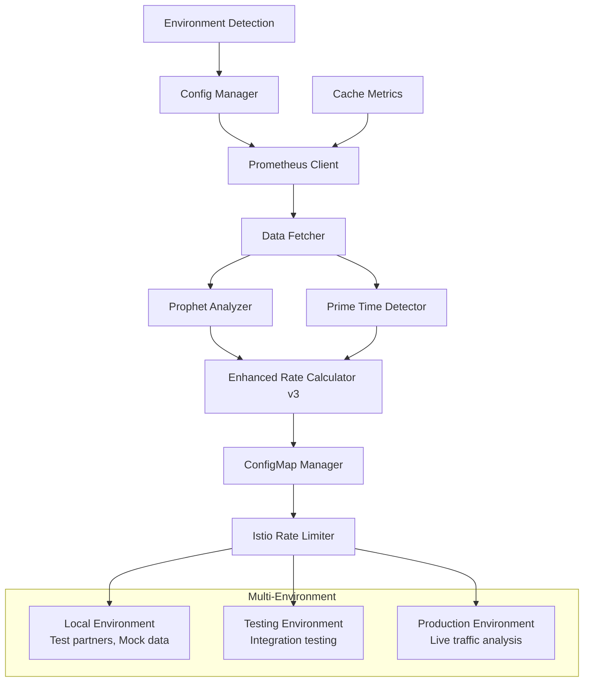

# TrendMaster-AI Adaptive Istio Rate Limiting System v3.0

[](https://github.com/your-org/TrendMaster-AI/actions)
[](https://opensource.org/licenses/MIT)
[](https://www.python.org/downloads/)
[](https://hub.docker.com)

## 🚀 Overview

An intelligent, ML-powered adaptive rate limiting system for Istio service mesh that automatically adjusts rate limits based on real-time traffic analysis, cache performance, and predictive modeling using Facebook Prophet.

### ✨ Key Features

- **🤖 ML-Powered Predictions**: Facebook Prophet for traffic forecasting and anomaly detection
- **🌍 Environment-Aware Configuration**: Automatic environment detection with different partner/API configurations
- **📊 Cache-Aware Rate Limiting**: Real cache hit ratio integration for accurate traffic calculations
- **🎯 Partner-Specific Optimization**: Individual rate limits per partner/API endpoint combination
- **🔄 Multi-Environment Support**: Local, Testing, and Production with different configurations
- **📈 v3 Formula**: Enhanced 2.5x average peak formula with cache considerations
- **🛡️ Production-Ready**: Comprehensive monitoring, alerting, and rollback capabilities
- **🐳 Docker Support**: Containerized deployment with production optimizations

## 🏗️ Architecture



## 📚 Documentation Sections

- [Quick Start Guide](./quickstart.md) - Get up and running in minutes
- [Installation Guide](./installation.md) - Detailed installation instructions
- [Configuration Reference](./configuration.md) - Complete configuration documentation
- [API Reference](./api.md) - API documentation and examples
- [Testing Guide](./testing.md) - Comprehensive testing documentation
- [Deployment Guide](./deployment.md) - Production deployment strategies
- [Troubleshooting](./troubleshooting.md) - Common issues and solutions
- [Contributing](./contributing.md) - How to contribute to the project

## 🧪 Test Status

All comprehensive tests are passing:

### ✅ Sanity Tests
- **Config Manager Initialization**: ✅ Passed
- **Data Fetcher Mock Data Generation**: ✅ Passed  
- **Prophet Analyzer Basic Analysis**: ✅ Passed
- **Rate Calculator Formula Application**: ✅ Passed
- **End-to-End ConfigMap Generation**: ✅ Passed

### ✅ Validation Tests  
- **Configuration Loading**: ✅ Passed
- **Mock Data Generation with Partners**: ✅ Passed
- **Prophet Analysis with Realistic Data**: ✅ Passed
- **Rate Calculation with Multipliers**: ✅ Passed
- **End-to-End System Test**: ✅ Passed
- **Environment Switching**: ✅ Passed

**Total: 11/11 tests passing** 🎉

## 🚀 Quick Start

```bash
# Clone the repository
git clone https://github.com/your-org/TrendMaster-AI.git
cd TrendMaster-AI/adaptive_istio_rate_limit

# Install dependencies
pip install -r requirements.txt

# Run tests
ENVIRONMENT=testing python tests/test_sanity.py
ENVIRONMENT=testing python tests/test_rate_calculation_validation.py

# Set environment and run
ENVIRONMENT=testing python scripts/main.py --show-env
```

## 📈 v3 Formula

Version 3.0 introduces an advanced formula that considers cache performance and environment-specific factors:

```python
# Core v3 Formula: 2.5x Average Peak (excluding anomalies)
effective_peak = calculate_average_peak_excluding_anomalies(traffic_data)
base_rate = effective_peak * 2.5

# Cache-Aware Adjustment
cache_hit_ratio = get_real_cache_metrics()
cache_adjustment = 1.0 + (cache_hit_ratio * 0.2)  # Up to 20% adjustment
adjusted_rate = base_rate * cache_adjustment

# Environment-Specific Safety Margins
safety_margin = get_environment_safety_margin()  # 1.5x for testing
final_rate = adjusted_rate * safety_margin

# Apply bounds and rounding
final_rate = apply_bounds_and_rounding(final_rate)
```

## 🌍 Environment Support

| Environment | Purpose | Partners | APIs | Mock Data |
|-------------|---------|----------|------|-----------|
| **local** | Development | 0 | 0 | ✅ Yes |
| **testing** | Integration Tests | 3 | 4 | ✅ Yes |
| **production** | Live Traffic | Variable | Variable | ❌ No |

## 🔧 System Requirements

- **Python**: 3.11+
- **Kubernetes**: 1.20+
- **Istio**: 1.15+
- **Prometheus**: 2.30+
- **Memory**: 512Mi minimum
- **CPU**: 100m minimum

## 📊 Performance Metrics

- **Startup Time**: < 5 seconds
- **Analysis Speed**: ~100 partner/API combinations per minute
- **Memory Usage**: ~256Mi typical
- **Prophet Analysis**: ~2-3 seconds per partner/API
- **ConfigMap Generation**: < 1 second

## 🛡️ Security Features

- ✅ **No Sensitive Data in Git**: Partner IDs, API paths, and URLs excluded
- ✅ **Environment-Based Loading**: Production loads from ConfigMaps
- ✅ **Secure Configuration**: Hidden local config for development
- ✅ **RBAC Integration**: Kubernetes service account support

## 📞 Support

- **Documentation**: [GitHub Pages](https://your-org.github.io/TrendMaster-AI/)
- **Issues**: [GitHub Issues](https://github.com/your-org/TrendMaster-AI/issues)
- **Discussions**: [GitHub Discussions](https://github.com/your-org/TrendMaster-AI/discussions)

---

**Made with ❤️ by the TrendMaster-AI Team**

*TrendMaster-AI v3.0 - Intelligent, Environment-Aware, Production-Ready Rate Limiting*